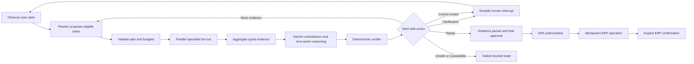

# Vendrai Technical Architecture and Agent Explainer

## One-sentence architecture

Vendrai is a durable, evidence-driven multi-agent investigation system in which
Gemini plans and interprets bounded work, specialist agents gather evidence in
parallel, deterministic controls verify safety, humans authorize risky actions,
and an ERP sandbox confirms the final write.

## What makes it autonomous

Autonomy is not an LLM producing prose. Vendrai observes case state, chooses
eligible investigation capabilities, dispatches them, evaluates their evidence,
changes route when evidence is incomplete or contradictory, requests help when
necessary, and resumes from durable state.

The agent can decide to:

- Launch different specialists for different cases.
- Retrieve additional policy clauses.
- Ask a targeted clarification.
- Retry a failed provider.
- Add a human control based on supported findings.
- Stop because evidence is insufficient.

The agent cannot change permissions, clear sanctions, authorize bank changes,
or write to ERP without the prescribed human and policy gates.

## Why this is multi-agent rather than one large prompt

Each specialist has a bounded responsibility, tool set, schema, timeout, and
measurable result:

| Agent | Responsibility | Typical tools | Authority |
|---|---|---|---|
| Planner | Select eligible investigations | Capability registry, current state | Proposes a validated plan |
| Document Intelligence | Extract fields, layout, confidence | Native PDF, Docling, Tesseract, EasyOCR | Evidence only |
| Entity Resolution | Find vendor candidates | ERP sandbox search, deterministic matcher | Candidate generation only |
| Sanctions | Search current official datasets | Local normalized OFAC/UN/EU indexes | Candidate generation only |
| Policy Research | Retrieve applicable clauses | Qdrant hybrid retrieval and reranker | Citations only |
| PO/GRN | Retrieve and normalize references | ERP sandbox API | Evidence only |
| Invoice Match | Compare invoice, PO, and GRN | Decimal matching and tolerance engine | Deterministic result |
| Reasoning | Find contradictions and choose next action | Gemini structured output | Bounded recommendation |
| Evidence Builder | Assemble claims and sources | Shared case state | Packet construction |
| Verifier | Reject unsupported or unsafe recommendations | Deterministic checks plus Gemini critique | Can block, cannot approve |
| ERP | Submit approved operation | OPA and ERP sandbox | Executes only authorized payload |

Calling every function an agent would make the architecture less credible.
Parsing, hashing, authorization, and database operations remain tools or
deterministic services.

## The agent loop

The loop ends at completion, human rejection, cancellation, a non-retryable
blocker, or a configured budget/deadline.

## How tools are chosen

The model never invents a tool name. It selects a capability from a server-side
registry. The registry declares prerequisites, tool permissions, data
classification, schemas, timeout, and failure policy.

Example:

- If the case has a usable supplier name, entity and sanctions agents become
  eligible.
- If it is a software supplier with data access, policy retrieval may expose a
  security review requirement.
- If an invoice includes a PO reference, PO and GRN retrieval can run alongside
  document extraction.
- If extraction confidence is inadequate, downstream identity-dependent work
  waits and the planner can request clarification.

The application validates every proposed plan. This gives dynamic routing
without arbitrary tool execution.

## Parallel execution

Parallelism is used only when results do not depend on each other. Each branch
has a durable step record. The bounded executor captures each exception as a
typed branch result, so the fan-in retains successful siblings and classifies
failures individually instead of allowing one exception to abort aggregation.

The UI proves parallelism using actual persisted start/end timestamps, summed
agent compute, critical path and calculated parallel time saved. It does not
manufacture animation or timing data.

## Failure recovery

Every failure is classified:

- Retryable provider/transient failure.
- Non-retryable input failure.
- Optional partial failure.
- Mandatory control failure.
- Human information required.

Retries use bounded exponential backoff and idempotency keys. Completed sibling
steps are not repeated. LangGraph checkpoints persist human pauses and worker
restart state. A notification failure retries independently. A mandatory
sanctions, evidence, approval, or ERP-confirmation failure blocks only the
unsafe transition.

Gemini errors remain distinguishable:

- `LLM_AUTH_INVALID`
- `LLM_QUOTA_EXCEEDED`
- `LLM_RATE_LIMITED`
- `LLM_OUTPUT_INVALID`
- `LLM_PROVIDER_UNAVAILABLE`

No error is silently translated into `PASS`.

## Explainability

Vendrai does not expose private chain-of-thought. It exposes:

- Selected route and why each capability was eligible.
- Structured agent conclusions and reason codes.
- Document page and bounding-box evidence.
- Policy citations and retrieval scores.
- Deterministic calculations and match signals.
- Confidence and unresolved issues.
- Provider, prompt, model, policy, dataset, and parser versions.
- Human decisions, evidence hash, case version, and ERP confirmation.

An explanation is accepted only when its citations exist in the evidence packet
and it does not contradict deterministic outcomes.

## Guardrails

Guardrails exist at multiple layers:

1. **Identity:** Keycloak role and tenant claims.
2. **Data:** PostgreSQL RLS, tenant-scoped object keys, retrieval filters, cache
   prefixes, and event routing.
3. **Privacy:** local extraction and PII tokenization before Gemini.
4. **Planning:** allowlisted capabilities, schemas, budgets, and dependency
   validation.
5. **Tooling:** typed tool gateway, no model credentials or SQL access.
6. **Evidence:** citations, packet hashing, deterministic verification.
7. **Human control:** version/evidence-bound decisions and segregation of duties.
8. **Execution:** OPA policy and idempotent ERP confirmation.
9. **Observability:** source-level redaction and tamper-evident audit.

## Retrieval and context

Policy retrieval uses parent/child chunks, dense and sparse search, RRF fusion,
cross-encoder reranking, and tenant/ACL/effective-date filters. Insufficient
retrieval returns `INSUFFICIENT_EVIDENCE`.

The application copilot uses:

- A small versioned CAG pack for stable product rules and UI vocabulary.
- RAG for published help, FAQ, policy, and authorized case evidence.
- Page context for the current screen.
- Explicit user preferences that never change authority.

The Context Assembly Gateway constructs and logs the minimum authorized context.
Conversation history is untrusted context, not policy or memory.

The current copilot implementation uses the versioned procedural CAG pack and
authorization-filtered live case context. Published-help RAG and controlled
administrator promotion of a new CAG version remain follow-on gates; the
assistant never learns authority from chat.

## Memory

- **Working:** current workflow state and checkpoints.
- **Episodic:** a schema exists for reviewed, de-identified approved-case
  summaries, but this memory is not enabled in the competition path.
- **Semantic:** published policy and help knowledge.
- **Procedural:** versioned workflow, prompts, schemas, and capability registry.

Raw chain-of-thought and unapproved model output are never stored as memory.

## Real demo data and services

“No mock demo” means:

- Uploaded PDFs are processed during the demonstration.
- Gemini is called during the run.
- Qdrant searches actual indexed synthetic policy documents.
- Sanctions results come from a versioned official dataset snapshot.
- ERP records are queried and mutated through a persistent sandbox API.
- Outputs are not selected from case-number conditionals or prefetched JSON.

The ERP sandbox is a real test integration, not a claim that a customer SAP or
Oracle environment is connected.

## What to open for technical inspection

The admin diagnostic drawer should expose:

- Selected graph and step timing.
- Event and trace correlation IDs.
- Redacted tool inputs/outputs.
- Retrieval candidates and citations.
- Checkpoint sequence.
- OPA decision.
- Evidence and audit hash verification.
- ERP operation and confirmation.

Source code entry points:

- `services/api/app/agents/workflow.py`
- `services/api/app/agents/contracts.py`
- `services/api/app/llm_gateway.py`
- `services/api/app/workers/agent.py`
- `services/api/app/workers/invoice_agent.py`
- `services/api/app/workers/erp.py`
- `services/api/app/retrieval_service.py`
- `apps/web/src/app/cases/[id]/page.tsx`
